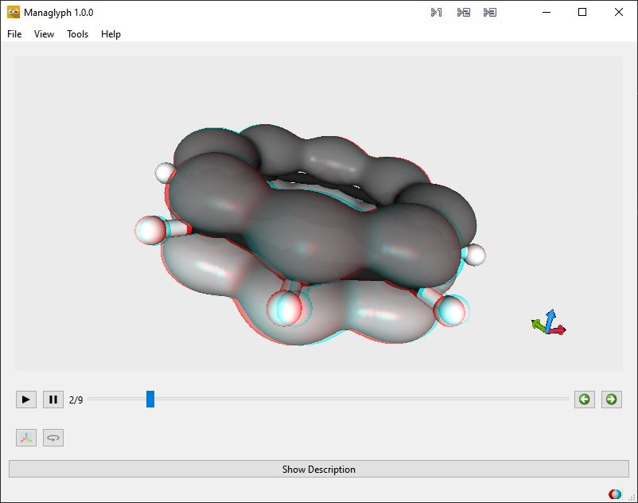
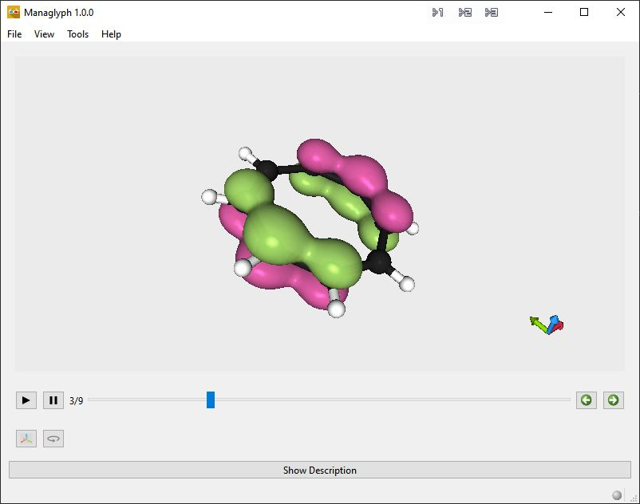
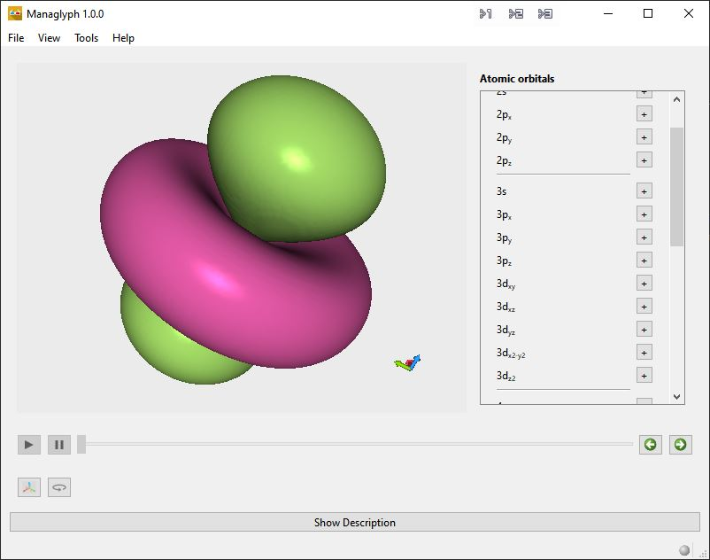

# Managlyph

## Overview
Managlyph is a powerful educational tool for visualizing atomic and molecular
structures in 3D. It enables students and educators to explore atomic orbitals,
reaction mechanisms, and molecular properties interactively, enhancing learning
through dynamic 3D visualizations using red/cyan glasses or 3D monitors. Its
versatility and ease of use make it an invaluable resource for teaching complex
chemical concepts.

## Features

- **Anaglyph Projection**: Immerse yourself in stunning 3D visualizations with
  just a simple pair of red/cyan anaglyph glasses, bringing depth and realism to
  your viewing experience. For those with specialized 3D equipment, the system
  also supports interlacing, enabling seamless compatibility with a wide range
  of 3D monitors and projectors. Whether you're exploring 3D content on basic
  setups or advanced displays, this feature ensures accessibility and enhanced
  visual performance for everyone.

  
- **Molecular Orbitals**: Managlyph leverages the versatile 'Atom Bond Object'
  (ABO) file format, a powerful tool for embedding and managing multiple
  atomistic structures. These files can encapsulate complex details, such as
  molecular geometries, chemical bonding, and even molecular orbitals
  represented as isosurfaces. This flexibility allows for the seamless
  integration and visualization of intricate structural and electronic
  properties, making it an invaluable resource for advanced scientific modeling
  and analysis. 

  
- **Atomic Orbitals**: Create, project, and rotate atomic orbitals up to the 4f
  subshell, providing an unparalleled opportunity to explore the intricate
  details of atomic structures. This capability allows users to visualize and
  analyze the shapes, orientations, and complexities of orbitals in 3D, offering
  a deeper understanding of quantum mechanics and atomic interactions.

  
- **Elementary Reaction Steps**: Visualize and illustrate intricate reaction
  mechanisms with precision by sliding along the reaction coordinate. This
  dynamic approach allows you to observe each stage of the reaction in
  real-time, pausing at critical points to highlight key events such as bond
  breaking, bond formation, and intermediate states. This interactive feature
  provides a deeper understanding of reaction dynamics and pathways, making it
  an invaluable tool for both teaching and research.

## Boost

**Managlyph** was developed with the generous financial support of the
[TU/e boost program](https://boost.tue.nl/projects/3d-visualization-with-artificial-intelligence-and-projection/).