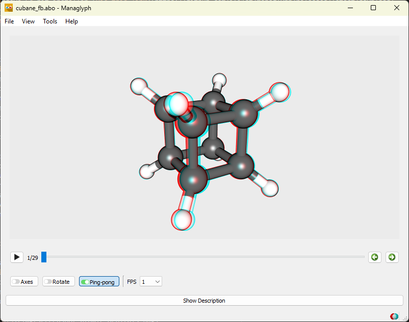
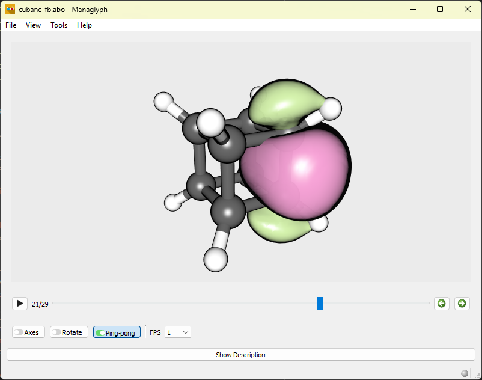
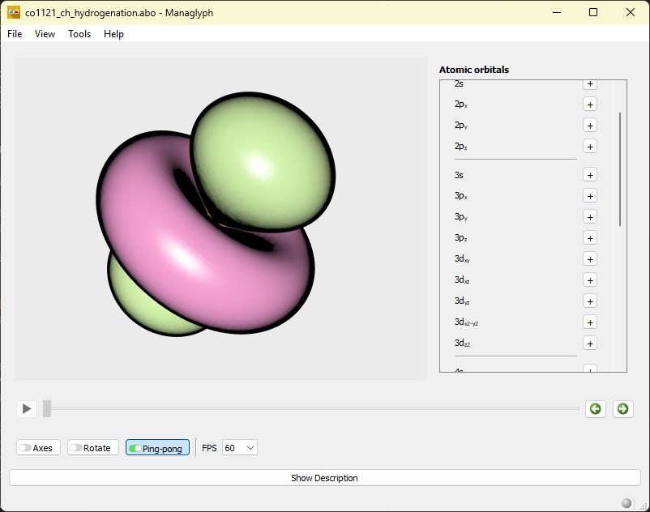
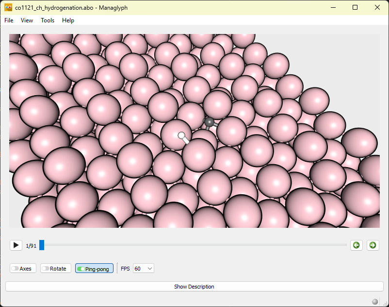

# Managlyph

## Overview
Managlyph is a powerful educational tool for visualizing atomic and molecular
structures in 3D. It enables students and educators to explore atomic orbitals,
reaction mechanisms, and molecular properties interactively, enhancing learning
through dynamic 3D visualizations using red/cyan glasses or 3D monitors.

> [!TIP]
> * Download the Windows 64 bit installer [via this link](https://github.com/ifilot/managlyph/releases/latest/download/managlyph-installer-win64.exe)
> * Detailed information on how to use Managlyph can be found in the [online manual](https://ifilot.github.io/managlyph/).

## Features

- **Anaglyph Projection**: Immerse yourself in stunning 3D visualizations with
  just a simple pair of red/cyan anaglyph glasses, bringing depth and realism to
  your viewing experience. For those with specialized 3D equipment, the system
  also supports interlacing, enabling seamless compatibility with a wide range
  of 3D monitors and projectors. Whether you're exploring 3D content on basic
  setups or advanced displays, this feature ensures accessibility and enhanced
  visual performance for everyone.

  

- **Molecular Orbitals**: Managlyph leverages the versatile 'Atom Bond Object'
  (ABO) file format, a powerful tool for embedding and managing multiple
  atomistic structures. These files can encapsulate complex details, such as
  molecular geometries, chemical bonding, and even molecular orbitals
  represented as isosurfaces. This flexibility allows for the seamless
  integration and visualization of intricate structural and electronic
  properties, making it an invaluable resource for advanced scientific modeling
  and analysis. 

  

- **Atomic Orbitals**: Create, project, and rotate atomic orbitals up to the 4f
  subshell, providing an unparalleled opportunity to explore the intricate
  details of atomic structures. This capability allows users to visualize and
  analyze the shapes, orientations, and complexities of orbitals in 3D, offering
  a deeper understanding of quantum mechanics and atomic interactions.

  

- **Reaction pathways**: Visualize elementary reaction steps and follow the
  transformation of molecular structures as chemical reactions unfold. Managlyph
  can display reaction events by smoothly transitioning between reactants,
  intermediates, transition states, and products, allowing users to observe bond
  breaking and formation in real time. This makes it possible to explore reaction
  mechanisms step-by-step, identify key structural changes, and better understand
  energetic and geometric factors that govern chemical reactivity.

  

## Boost

**Managlyph** was developed with the generous financial support of the
[TU/e boost program](https://boost.tue.nl/projects/3d-visualization-with-artificial-intelligence-and-projection/).