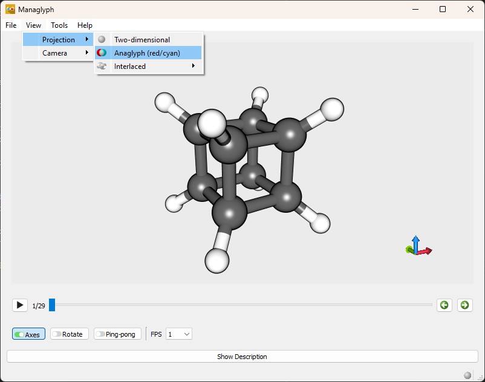
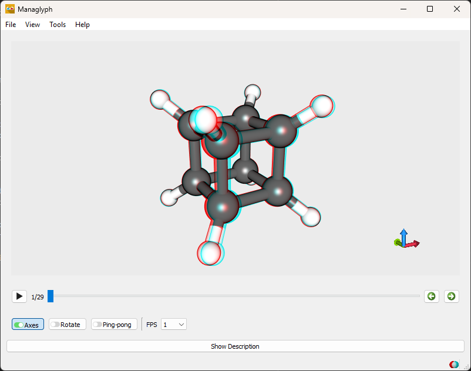
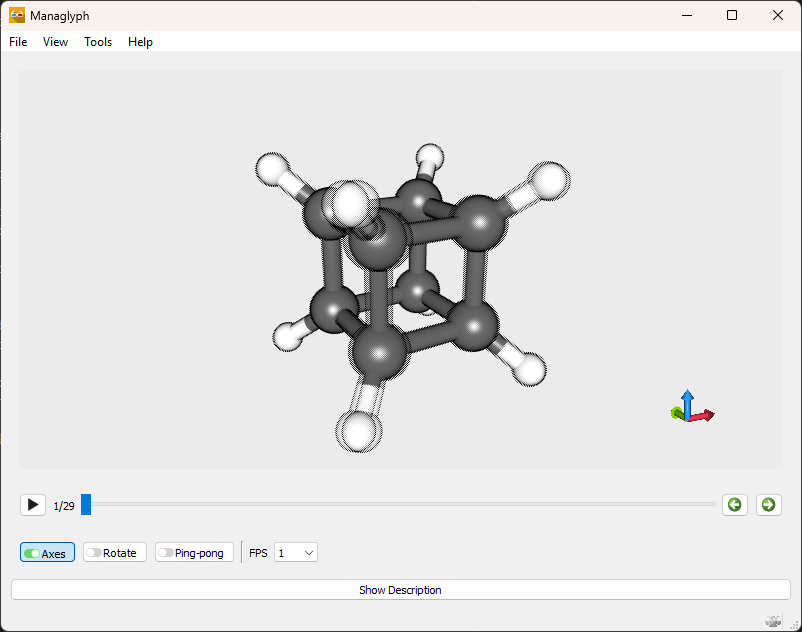
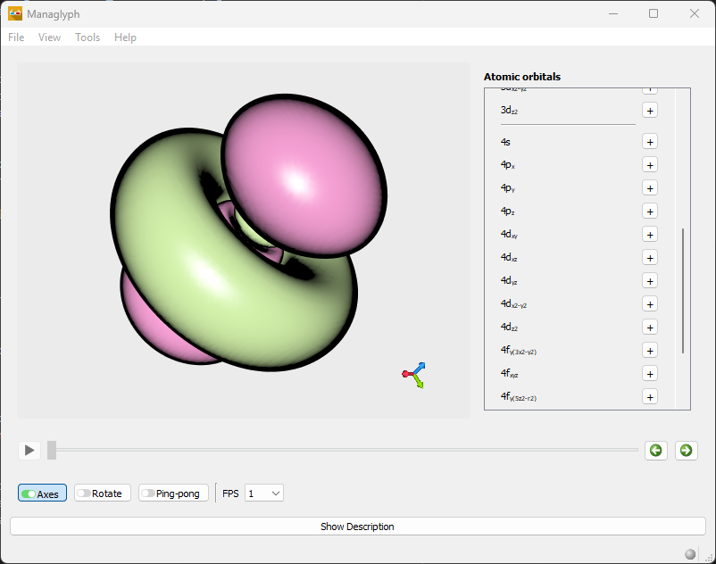
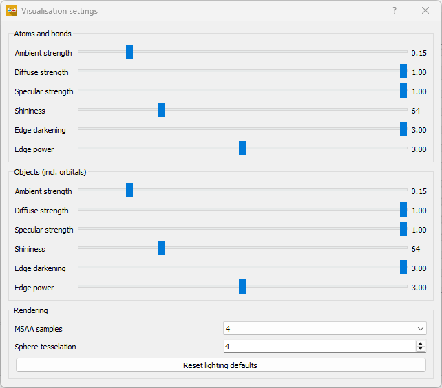

Usage
=====

Opening Files
-------------

Managlyph loads scene data from ABO containers. Files can be opened in several
ways:

- Select **File → Open** and choose a ``.abo`` file from the file system.
- Select **File → Open from Library** to browse the built-in library. The
  library is organized into categories and provides a search function for
  quickly locating example datasets.
- Drag and drop a ``.abo`` file directly into the anaglyph rendering widget.

Once loaded, the scene is rendered immediately.

3D Rendering
------------

Managlyph supports stereographic output for 3D visualization. The projection
mode can be selected via **View → Projection**.

   File menu showing the available rendering options.

Available modes include:

- **Anaglyph (red/cyan)** for use with red/cyan 3D glasses.
- **Interlaced** for compatible 3D displays and televisions.

   Example of red/cyan anaglyph rendering. When viewed with red/cyan glasses,
   the scene appears in stereoscopic 3D.

When using interlaced output, additional layout options are available:

- line interlaced
- column interlaced
- checkerboard pattern

   Checkerboard interlaced rendering. The image may appear visually unusual
   because adjacent pixels are alternately assigned to the left and right eye.
   When viewed on a compatible display, the image resolves into a stereoscopic
   3D scene.

The display order of the stereo pair can also be configured by selecting which
eye is rendered first.

Changes to projection settings are applied immediately.

Interface Controls
------------------

The main toolbar provides quick access to visualization and playback controls.

**Axes**
   Toggles the display of the 3D coordinate axes. When enabled, the axes
   provide spatial orientation within the scene.

**Rotate**
   Enables continuous rotation of the scene about the z-axis. This can help
   reveal three-dimensional structure and depth.

**Ping-pong**
   Controls playback behavior when multiple frames are present. When enabled,
   playback reverses direction at the final frame, producing a back-and-forth
   motion. When disabled, playback restarts from the first frame after reaching
   the end.

**FPS**
   Sets the playback speed in frames per second. Higher values increase motion
   smoothness, while lower values slow the animation for closer inspection.

Atomic Orbitals
---------------

Managlyph can visualize atomic orbitals using the built-in orbital generator.

To construct an orbital, open **Tools → Orbital**. The menu lists available
orbitals from **1s** through **4f**. Selecting the **“+”** button next to an
orbital generates its surface representation and displays it in the scene.

Multiple orbitals may be added to the same frame for comparison or
visualization purposes.

   Visualization of the 4d\ :sub:`z²` atomic orbital. The orbital surface
   represents regions of equal probability density for the electron.

Visualization Settings
----------------------

Visualization settings control lighting, shading, and rendering quality.
These settings can be accessed via **Tools → Visualisation settings**.

   Visualisation settings panel.

Lighting Parameters
-------------------

Lighting controls are provided separately for **Atoms and bonds** and
**Objects (including orbitals)**. This allows independent tuning of molecular
structures and surface models.

**Ambient strength**
   Controls the baseline illumination applied uniformly to the object.
   Higher values brighten shadowed regions.

**Diffuse strength**
   Controls how strongly surfaces respond to directional light.
   Increasing this value enhances shape perception.

**Specular strength**
   Controls the intensity of reflective highlights.
   Higher values produce stronger glossy reflections.

**Shininess**
   Controls the size and sharpness of specular highlights.
   Higher values produce smaller, sharper highlights.

**Edge darkening**
   Darkens object edges to enhance depth perception and separation between
   overlapping surfaces.

**Edge power**
   Controls the strength and falloff of the edge-darkening effect.

Rendering
---------

**MSAA samples**
   Sets the number of multisample anti-aliasing samples used to smooth jagged
   edges. Higher values improve visual quality at increased GPU cost.

**Sphere tessellation**
   Controls the geometric detail used when rendering atoms as spheres.
   Higher values produce smoother spheres but require more processing.

**Reset lighting defaults**
   Restarts all lighting parameters to their default values.